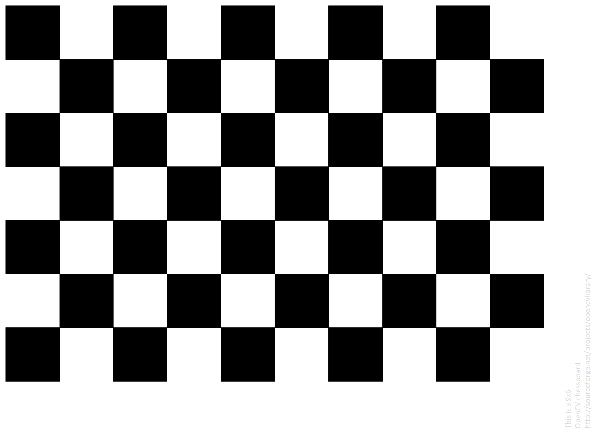
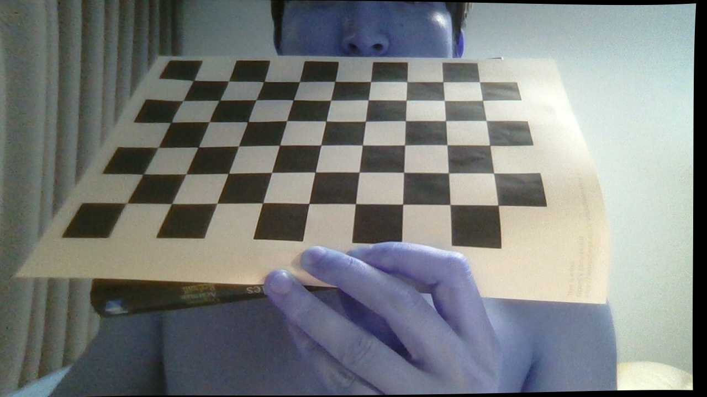

## Camera Calibration with OpenCV

The IPython notebook in this repository contains code to calculate the camera matrix and distortion coefficients using the images in the "calibration_wide" folder.
JUST SMALL PROJECT TO PRACTICE THE CARMERA CALIBRATION using my labtop

# This is the gif image while taking the pattern board

- Pattern Image is here

# The result is not good

- I think that the pattern pictures are needed more and there are more clearity

original

result

