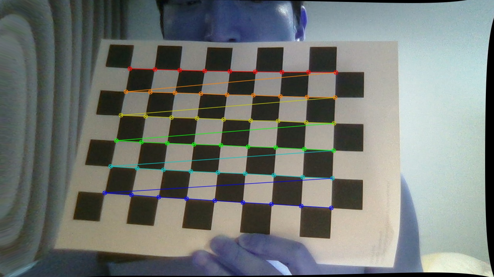

## Camera Calibration with OpenCV

The IPython notebook in this repository contains code to calculate the camera matrix and distortion coefficients using the images in the "calibration_wide" folder.
JUST SMALL PROJECT TO PRACTICE THE CARMERA CALIBRATION using my labtop

# This is the gif image while taking the pattern board

- Pattern Image is here

# The result is not good

- I think that the pattern pictures are needed more and there are more clearity
(10/26)
- It would be better after using the warpPerspective. Check the below picture 

original

result only using distortion

result with warp
M=cv2.getPerspectiveTransform(src_pt,dst_pt)
warped = cv2.warpPerspective(dst, M, (img.shape[1],img.shape[0]))

